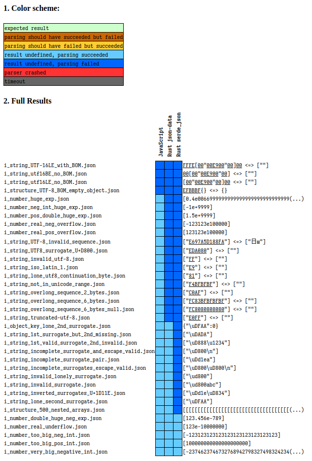

# json-data

JavaScript code can generate JSON containing lonely surrogate pairs.
However, the popular [`serde_json`](https://github.com/serde-rs/json) does not support parsing such JSON.

This library supports such strings using its own `JsonString` type.

Comparison generated using [JSON Parsing Test Suite](https://github.com/nst/JSONTestSuite):

